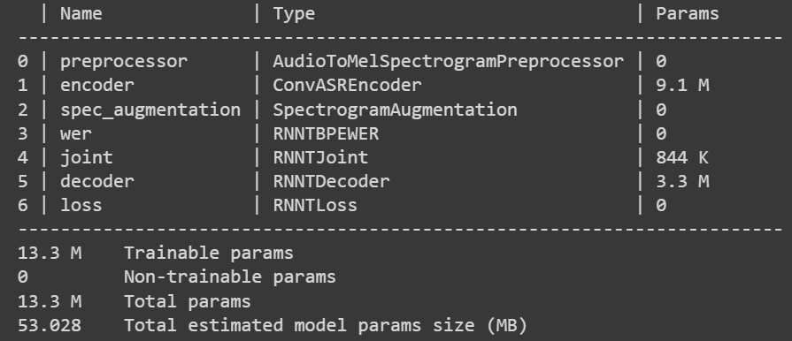

## Finetuning ASR Model on Low Resource Languages (Turkish)
For this project, we will attempt to fine-tune a ASR model onto speech dataset for Turkish.
This repo will also allow us to discuss in detail how to **fine-tune a pre-trained subword-based (n-gram characters) CTC model onto a new low-resource language with a small dataset.**

### Table of Contents :tada:

- [Download and Prepare Free Audio Data for ASR](#Download-and-Prepare-Free-Audio-Data-for-ASR)
- [Custom ASR Data Preperation](#Custom-ASR-Data-Preperation)
- [Text-Pre-processing-(Normalization,-Clean-up)](#Text-Pre-processing-(Normalization,-Clean-up))
- [Speech Data Augmentation](#Speech-Data-Augmentation)
- [Sub-word Encoding CTC Model](#Sub-word-Encoding-CTC-Model)
- [The necessity of subword tokenization](#The-necessity-of-subword-tokenization)
- [Build Custom Subword Tokenizer](#Build-Custom-Subword-Tokenizer)
- [Specifying Model with YAML Config File](#Specifying-Model-with-YAML-Config-File)
- [Citrinet Model Parameters](#Citrinet-Model-Parameters)
- [Specifying the Tokenizer to The Model and Update Custom Vocabulary](#Specifying-the-Tokenizer-to-The-Model-and-Update-Custom-Vocabulary)
- [Training with PyTorch Lightning](#Training-with-PyTorch-Lightning)

---
### Download and Prepare Free Audio Data for ASR
You can download and create `manifest.jsonl` from some of the common publically available speech dataset in **English**, **Turkish** and some **other languages** from my repository [speech-datasets-for-ASR](https://github.com/Rumeysakeskin/speech-datasets-for-ASR).

---
### Custom ASR Data Preperation
The `nemo_asr` collection expects each dataset to consist of a set of utterances in individual audio files plus a manifest that describes the dataset, with information about one utterance per line `(.json)`.
Each line of the manifest `(data/train_manifest.jsonl and data/val_manifest.jsonl)` should be in the following format:
```python
{"audio_filepath": "/data/train_wav/audio_1.wav", "duration": 2.836326530612245, "text": "bugün hava durumu nasıl"}
```
The `audio_filepath` field should provide an absolute path to the `.wav` file corresponding to the utterance. The `text` field should contain the full transcript for the utterance, and the `duration` field should reflect the duration of the utterance in seconds.

---
### Text Pre-processing (Normalization, Clean-up)
Text cleaning and normalization is the process of preparing raw text for down-stream process. Open the following notebook for Turkish text normalization.
```python
preprocess_manifest_file.ipynb
```

---
### Speech Data Augmentation
Also, you can use my repository [
speech-data-augmentation](https://github.com/Rumeysakeskin/speech-data-augmentation) to **increase the diversity** of your dataset augmenting the data artificially for ASR models training.

---
### Sub-word Encoding CTC Model
A sub-encoding model accepts a sub-word tokenized text corpus and emits sub-word tokens in its decoding step. 
This repository will detail how we prepare a CTC model which utilizes a sub-word Encoding scheme.
We will utilize a pre-trained Citrinet model trained on roughly 7,000 hours of English speech as the base model. 
We will modify the decoder layer (thereby changing the model's vocabulary) for training.

---
### The necessity of subword tokenization

Subword tokenization is a solution between word and character-based tokenization. The main idea is to solve the issues faced by word-based tokenization (very large vocabulary size, large number of OOV tokens, and different meaning of very similar words) and character-based tokenization (very long sequences and less meaningful individual tokens).

As the corpus size increases, the number of unique words increases too and this leads to a larger vocabulary size which causes memory and performance problems during processing.

Subword tokenization not only reduces the length of the tokenized representation (thereby making sentences shorter and more manageable for models to learn), but also boosts the accuracy of prediction of correct tokens.

Some of the popular subword tokenization algorithms are _WordPiece, Byte-Pair Encoding (BPE), Unigram, and SentencePiece_. 
- BPE is used in language models like GPT-2, RoBERTa, XLM, FlauBERT, etc.

- SentencePiece is an extension of two sub-word segmentation algorithms, byte-pair encoding, and a uni-gram language model. SentencePiece does not need pre-tokenized word sequences, unlike BPE and ULM.

<!--
---
### Tokenization Method for Turkish
The impact of tokenization algorithms can be different for low-resource languages, such as agglutinative languages, where words can have prefixes and suffixes. For instance, in Turkish, parsing the word "veremedim" (translated as "I could not give") results in "ver-e-me-di-m" including four suffixes in a single word. A Morphological-level tokenizer can output five tokens in this case, providing the model with a better understanding of word semantics. An example benefit is that the language model would relate the suffix "-me" to negation, similar to the word "not" in English. 

Recently, [Xu et al.](https://aclanthology.org/2021.acl-long.571/) approach the problem of finding the best token vocabulary with a proper size in the scope of the trade-off between vocabulary entropy and vocabulary size. The produced vocabularies in diverse scenarios achieve both reduced sizes and performance improvements. In addition, learning optimal vocabulary takes significantly less time than regular BPE-search approach.
-->


---
### Build Custom Subword Tokenizer

We will utilize the SentencePiece tokenizer in this study.
Following NeMo script was used to easily build a tokenizer for Turkish speech dataset.

```python
!python scripts/process_asr_text_tokenizer.py \
  --manifest=$train_manifest \
  --vocab_size=$VOCAB_SIZE \
  --data_root=$tokenizer_dir \
  --tokenizer="spe" \
  --spe_type=$TOKENIZER_TYPE \
  --spe_character_coverage=1.0 \
  --no_lower_case \
  --log
```

- Open the `tokenizer_for_sub_word_encoding_CTC_model.ipynb` script in the Colab and create your custom tokenizer for your dataset.

**Note:** You can find more information about subword tokenization in [Finetuning CTC models on other languages](https://github.com/NVIDIA/NeMo/blob/main/tutorials/asr/ASR_CTC_Language_Finetuning.ipynb) for your language.

Our tokenizer is now built and stored inside the `data_root` directory that we provided to the script.

- Check for getting the subwords of the transcript or tokenizing a dataset using the same tokenizer as the ASR model. 

Output:
```python
[NeMo I 2023-01-12 06:16:05 ctc_bpe_models:341] Changed tokenizer to ['<unk>', '▁', 'a', 'e', 'i', 'n', 'l', 'ı', 'k', 'r', 'm', 't', 'u', 'd', 'y', 's', 'b', 'o', 'z', 'ü', 'ş', 'ar', 'g', 'ç', 'h', 'v', 'p', 'c', 'f', 'ö', 'j', 'w', 'q', '̇', 'x', 'ğ'] vocabulary.
tokenizer: <nemo.collections.common.tokenizers.sentencepiece_tokenizer.SentencePieceTokenizer object at 0x7fde5605d280>
tokens: ['▁', 'm', 'e', 'r', 'h', 'a', 'b', 'a', '▁', 'n', 'a', 's', 'ı', 'l', 's', 'ı', 'n']
token_ids: [1, 10, 3, 9, 24, 2, 16, 2, 1, 5, 2, 15, 7, 6, 15, 7, 5]
subwords: ['▁', 'm', 'e', 'r', 'h', 'a', 'b', 'a', '▁', 'n', 'a', 's', 'ı', 'l', 's', 'ı', 'n']
text: merhaba nasılsın
```

---
### Specifying Model with YAML Config File
For this project, we will build citrinet model using the configuration found in `confing/config_bpe.yaml`. You can use another config file for your model in [Nemo ASR conf](https://github.com/NVIDIA/NeMo/tree/main/examples/asr/conf).  
```python
import os
if not os.path.exists("configs/config_bpe.yaml"):
  !wget -P configs/ https://raw.githubusercontent.com/NVIDIA/NeMo/$BRANCH/examples/asr/conf/citrinet/config_bpe.yaml
  
config_path = "configs/config_bpe.yaml"

yaml = YAML(typ='safe')
with open(config_path) as f:
    params = yaml.load(f)
```

---
### Citrinet Model Parameters

```python
first_asr_model = nemo_asr.models.EncDecCTCModelBPE(cfg=DictConfig(params['model']))
first_asr_model = first_asr_model.restore_from("stt_en_contextnet_256.nemo")
```


---
### Specifying the Tokenizer to The Model and Update Custom Vocabulary

Specify the tokenizer to the model parameters and change the vocabulary of a sub-word encoding ASR model is as simple as passing the path of the tokenizer dir to `change_vocabulary()`.
```python
params['model']['tokenizer']['dir'] = TOKENIZER_DIR
params['model']['tokenizer']['type'] = 'bpe'

first_asr_model.change_vocabulary(new_tokenizer_dir=TOKENIZER_DIR, new_tokenizer_type="bpe")
```

---
### Training with PyTorch Lightning

NeMo's models are based on PytorchLightning's LightningModule and we use PytorchLightning for training and fine-tuning as it makes using mixed precision and distributed training very easy.

```python
trainer = pl.Trainer(devices=1, accelerator='cpu',num_nodes=1,  # accelerator='ddp'
                  max_epochs=EPOCHS,
                  logger=wandb_logger, log_every_n_steps=1,
                  val_check_interval=1.0, enable_checkpointing=checkpoint_callback)

first_asr_model.set_trainer(trainer)
trainer.fit(first_asr_model)
```

---
### Referances
- [Jump-start Training for Speech Recognition Models in Different Languages with NVIDIA NeMo](https://developer.nvidia.com/blog/jump-start-training-for-speech-recognition-models-with-nemo/)
- [ASR_with_Subword_Tokenization](https://github.com/NVIDIA/NeMo/blob/main/tutorials/asr/ASR_with_Subword_Tokenization.ipynb)


