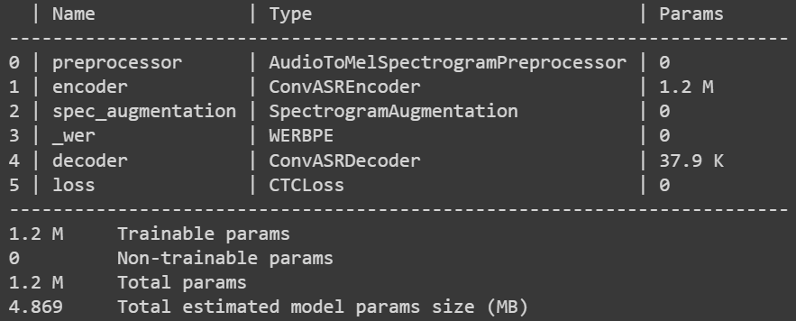

## Finetuning ASR Model on Low Resource Languages (Turkish)
For this project, we will attempt to fine-tune a ASR model onto speech dataset for Turkish.
This repo will also allow us to discuss in detail how to **fine-tune a pre-trained model onto a new low-resource language with a small dataset.**

### Download and Prepare Free Audio Data for ASR
You can download and create `manifest.jsonl` from some of the common publically available speech dataset in **English**, **Turkish** and some **other languages** from my repository [speech-datasets-for-ASR](https://github.com/Rumeysakeskin/speech-datasets-for-ASR).

### Custom ASR Data Preperation
The `nemo_asr` collection expects each dataset to consist of a set of utterances in individual audio files plus a manifest that describes the dataset, with information about one utterance per line `(.json)`.
Each line of the manifest `(data/train_manifest.jsonl and data/val_manifest.jsonl)` should be in the following format:
```
{"audio_filepath": "/data/train_wav/audio_1.wav", "duration": 2.836326530612245, "text": "bugün hava durumu nasıl"}
```
The `audio_filepath` field should provide an absolute path to the `.wav` file corresponding to the utterance. The `text` field should contain the full transcript for the utterance, and the `duration` field should reflect the duration of the utterance in seconds.

### Speech Data Augmentation
Also, you can use my repository [
speech-data-augmentation](https://github.com/Rumeysakeskin/speech-data-augmentation) to **increase the diversity** of your dataset augmenting the data artificially for ASR models training.

### Sub-word Encoding CTC Model
A sub-encoding model accepts a sub-word tokenized text corpus and emits sub-word tokens in its decoding step. 
This repository will detail how we prepare a CTC model which utilizes a sub-word Encoding scheme.
We will utilize a pre-trained Citrinet model trained on roughly 7,000 hours of English speech as the base model. 
We will modify the decoder layer (thereby changing the model's vocabulary) for training.

### Build Custom Subword Tokenizer
- #### The necessity of subword tokenization

Subword tokenization not only reduces the length of the tokenized representation (thereby making sentences shorter and more manageable for models to learn), but also boosts the accuracy of prediction of correct tokens.
By reducing the target sentence length by subword tokenization (target sentence here being the characters/subwords transcribed from the audio signal), we entirely sidestep the sequence length limitation of CTC loss!
This means we can perform a larger number of pooling steps in our acoustic models, thereby improving execution speed while simultaneously reducing memory requirements.

- #### Build custom tokenizer
NeMo script was used to easily build a tokenizer for Turkish speech dataset.

Open the `tokenizer_for_sub_word_encoding_CTC_model.ipynb` script in the Colab and create your custom tokenizer for your dataset.

**Note:** You can find more information about subword tokenization in [Finetuning CTC models on other languages](https://github.com/NVIDIA/NeMo/blob/main/tutorials/asr/ASR_CTC_Language_Finetuning.ipynb) for your language.

#### Load Citrinet model



#### Referans
-[Jump-start Training for Speech Recognition Models in Different Languages with NVIDIA NeMo](https://developer.nvidia.com/blog/jump-start-training-for-speech-recognition-models-with-nemo/)
- [ASR_with_Subword_Tokenization](https://github.com/NVIDIA/NeMo/blob/main/tutorials/asr/ASR_with_Subword_Tokenization.ipynb)


